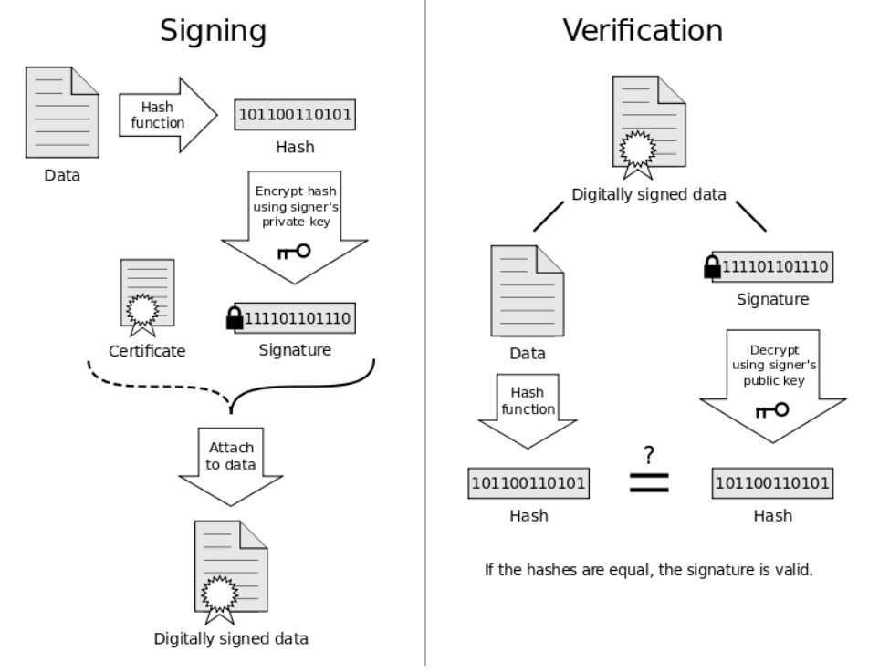

# Digital Signatures

***Target Audience:*** The contents of this project are for MATH5248 students or anyone with prior elementary knowledge of number theory, modular arithmetic, and public-key cryptography. 

<br>

### Have you ever received an email, or any other sensitive document which made you question it's authenticity and integrity? With **Digital Signatures** you won't be second guessing yourself. Unlike your traditional written signature, or even an electronic version of it, digital signatures are generated via Mathematical Algorithms and are verified for its authenticity and data integrity. Digital signatures are unique, meaning no two digital signatures are the same. 

<br>

### **What a Digital Signature provides :**
1. **Authentication :** Proof that a known sender created and signed the message/document.
2. **Data Integrity :** Proof that the message/document received by the recipient was not tampered with. 
3. **Non-repudiation :** The known sender can't deny the signing of the message/document after the creation of the signature. 

<br>

### **NOTE:** A standalone digital signature doesn't allow for the identification of its creator. This however is resolved with a **digital certificate**, binding an identity (person, organization, ...) to the public key owner. 

<br>

## **The Digital Signature Scheme** 



### A digital signature scheme refers to the mathematical scheme in the process of generation, signing, and verification of the digital signature. 

<br>

### Common public-key cryptosystems, e.g. **RSA**, **ECC** allow for secure digital signature schemes. 

### Popular digital signature schemes include :  **RSA Signatures**, **ECDSA**, **EdDSA**

<br>

# RSA Signature : 

### Utilizes RSA to generate and verify signatures. Therefore, a focus on modular exponentiations, discrete logarithms, and integer factorization problem (IFP). The process of an RSA Signature scheme is broken into three steps: key pair generation {Public,Private}, sign, and verification. An in-depth example will be shown below. 

<br>

### Although RSA Signatures have been widely used in the signing of digital certificates (e.g. SSL/TLS certificates have longed been RSA signatures), adoption for **elliptic curve-based signatures** (e.g. ECDSA, EdDSA) have increased overtime. ECC signatures come with the benefits of shorter key length, shorter signature, higher security, and more performant. 

<br>

### RSA Signatures are deterministic. Meaning the same message/document paired with the same private key will produce the same signature every time. Undeterministic variants are achieved by padding the message/document with random bytes before signing. 

<br>

<br>

# Example procedure of RSA Signature :

## **Step 1 :** Key Pair Generation:
### This process is the same for as if you were generating a key pair for RSA encryption
- Choose two prime numbers, $p$ and $q$.
- Calculate $N = pq$.
- Calculate the Euler totient function of $N: \varphi(N)$.
- Choose a small odd integer $e$ such that $1 < e < \varphi(N)$ and $\gcd(e, \varphi(N)) = 1$.
- Calculate the private key exponent $d$ such that $d \equiv e^{-1} \pmod{\varphi(N)}$, the inverse modulo $\varphi(N)$.

$\therefore$ The **public key** is $\{N, e\}$ and the **private key** is $\{N, d\}$.

Now let's suppose Alice wants to send a message to Bob and sign it using RSA. Alice has the private key $\{N, d\}$ and Bob has the corresponding public key $\{N, e\}$.

## **Step 2:** Signature Calculation:

- Alice applies a cryptographic hash function on the message.
- Alice encrypts the hash using her private key exponent $d$ and modulus $N$. The signature, denoted by $S$ is calculated as $S = h^d \pmod{N}$.

Alice sends the message along with the signature $S$ to Bob.

## **Step 3:** Verifying the Signature:

- Bob receives the message and signature from Alice.
- Bob calculates hash of the message (NOTE: it has to be the same hashing algorithm that Alice used). 
- Bob decrypts the signature using Alice's public key exponent $e$ and modulus $n$. The decrypted signature is calculated as $h' = S^e \pmod{N}$.

Bob compares $h$ and $h'$. If they are equal, the signature is valid.

$h' = S^e \pmod{N} = (h^d)^e \pmod{N} = h$

<br>

## The following is a Python script that generates an RSA signature on a message and is verified :

```Python
from Crypto.PublicKey import RSA
from hashlib import sha256

# Key Pair generation (Public and Private)
keyPair = RSA.generate(bits=1024)
print(f"Public key: (n={int(keyPair.n)}, e={int(keyPair.e)})")
print(f"Private key: (n={int(keyPair.n)}, e={int(keyPair.d)})")

# Signing the message 
msg = b'Hello, Bob!'
hash = int.from_bytes(sha256(msg).digest(), byteorder='big')
sig = pow(hash,keyPair.d, keyPair.n)

# Verify signature 
hashFromSignature = pow(sig,keyPair.e,keyPair.n)
print("Hash:", hash)
print("Hash from Signature:", hashFromSignature)
print("Signature valid:", hash == hashFromSignature)
```

### Output :

```Bash
Public key: (n=147418757037561172630318938424239037591200113337839073210927948669828976900867444465106753573797178349775133591933725097255026713845475947185126598772152551213214588380030383783698053994762234076372843050702748228727587072780537038028902657251378805795746751529699781117589247566316643639684423277493902622331, e=65537)

Private key: (n=147418757037561172630318938424239037591200113337839073210927948669828976900867444465106753573797178349775133591933725097255026713845475947185126598772152551213214588380030383783698053994762234076372843050702748228727587072780537038028902657251378805795746751529699781117589247566316643639684423277493902622331, e=3591312900004611891234155868036771688006119611081006703380693835766461951071327640643309975496876294520235171812792585858992637498948055521983006394041935385166735884410452590232513548078796050356945355682844567802212373782698242759533837189251507597390741854520284935580950085830044071653748918703364266413)

Hash: 16891393070370887491337579337267756568811133579025718578562850919807189683583

Hash from Signature: 16891393070370887491337579337267756568811133579025718578562850919807189683583

Signature valid: True
```

<br>

# DSA (Digital Signature Algorithm)

### The DSA scheme is an alternative of RSA due to patent limitations prior to September 2000.

### DSA is a variant of the ElGamal Signature scheme. It computes a hash of the message/document, generates a random integer $k$ and computes the signature {$r$,$s$} :

- ### $r$ : computed from $k$
- ### $s$ : hash + private key exponent + $k$

### Signature verification computes : hash + public key exponent + signature {$r$,$s$}

<br>

### As integer $k$ is random, this makes DSA non-deterministic. 
- ### This non-deterministic property however introduces a potential vulnerability :
    - ### If two different messages/documents are signed using the same integer $k$ and private key, then an adversary can easily compute the signer's private key. 
    - ### A deterministic DSA variant calculates the random integer $k$ as **HMAC** or "Hashed Message Authentication Code", which combining the hash with the private key. 


### The same with RSA, elliptic-curve-based signatures are prefered in modern day digital signature schemes.


<br>

# ECDSA (Elliptic Curve Digital Signature Algorithm)

###  The ECDSA scheme is based on **ECC** or "elliptic-curve cryptography".

<br>

### It involves the Mathematics of **cyclic groups of elliptic curves over finite fields** and the **ECDLP problem** (elliptic-curve discrete logarithm problem).

<br>

### ECDSA is adapted upon DSA, making it a variant of the ElGamal signature scheme but modified to handle group elements (points of elliptic curve) :

<br>

### **Elliptic Curve :** Mathematical curve defined by the equation of the form $y^2 = x^3 + ax + b$, where $a$ and $b$ serve as constants. 
- ### The "points" of the elliptic curve correspond to the pairs of coordinates $(x,y)$ that satisfy the curve equation. They correspond as valid Public Keys for ECDSA. 
- ###  Only a subset of points on the curve satisfy the equation. This subset is called **the set of rational points** on the curve.

<br>

### ECDSA uses an elliptic curve, like ```secp256k1``` for example, which is used in Bitcoin for its implementation of public key cryptography. 

### The **Private Key** is derived as a random integer within the curve key length.

### The **Public Key** is computed by : PrivateKey $\times$ curve generator point

### The ECDSA Signature scheme is as follows : 
1. ### **Signing :** Computes a hash, then generates a random integer $k$ and  computes the signature {$r$,$s$}, where $r$ is computed from $k$ and $s$ computed by : hash + PrivateKey + $k$. The signature is non-deterministic due to integer $k$ being random. 
2. ### **Verification :** hash + PublicKey + signature {$r$,$s$}

### Like DSA, ECDSA is suseptible to the same vulnerabilities and also includes a deterministic variant. 
<br>

## **Generating your own digital signature :**

<br>

### **OpenSSL :**
- Although with the term "SSL" in its name, which would entail to a SSL/TLS certificate generation tool, OpenSSL also enables the user to generate their own digital signatures. Below is an example of generating an RSA signature scheme :
1. Create the signer key pair :
```
$ openssl genrsa -out private_key.pem 1024
$ openssl rsa -in private_key.pen -outofrm PEM -pubout -out public_key.pem
```
2. Signature creation :
```
$ openssl dgst -sha256 -sign private_key.pem -out signature.bin example_msg.txt
```
3. Verify Signature :
```
$ openssl dgst -sha256 -verify public_key.pem -signature signature.bin example_msg.txt
```
### **GnuPG (GNU Privacy Guard) :**
- Free and open-source implementation of the OpenPGP standard, which provides encryption and digital signature functionality. 
- Provides a CLI and GUI interface.

### 1. Key Pair generation
```Shell
$ gpg --full-generate-key
```
### 2. Sign with ```--clearsign``` 
```Shell
$ gpg --clearsign example.txt
```
### Resulting output in ```example.txt.asc```
```Shell
-----BEGIN PGP SIGNED MESSAGE-----
Hash: SHA256

hello
-----BEGIN PGP SIGNATURE-----

iHUEAREIAB0WIQQ1uJdh2V3GuPNIUdvqJDQxKrkpiQUCZErcLQAKCRDqJDQxKrkp
ieSqAP47nj7NCXRCcepeW/2MPrYQBOOfbwILZWnrEhoWYLvhGAEAmWj2YOKDRZxj
48UszA2da5Ja05dw/WclIHBZpWDIi9o=
=xM82
-----END PGP SIGNATURE-----
```
### 3. Detach signature method 
```Shell
$ gpg --output example.sig --detach-sig example.txt
$ gpg --verify example.sig example.txt
```

### Output : 
```Shell
gpg: Signature made Thu 27 Apr 2023 03:45:48 PM CDT
gpg:                using DSA key 35B89761D95DC6B8F34851DBEA2434312AB92989
gpg: Good signature from "<name> (testing DSA signature) <email>" [ultimate]
```
